<div align="center">

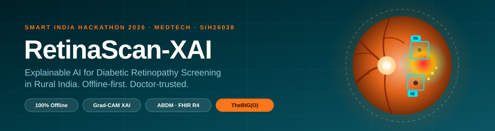

<br/>

[](https://sih26demobigo.onrender.com)
[](https://drive.google.com/file/d/1aWLT6qsj1q2M6xzOUJSGMgxc2XnRagXq/view?usp=drive_link)


_173175-fd761a?style=flat-square)
<br/>


### 👁️ *Catch blindness before it starts. Even where the nearest eye doctor is hours away.*

[**The Problem**](#-the-problem) ·
[**Our Solution**](#-our-solution) ·
[**Innovation**](#-whats-different) ·
[**Architecture**](#-architecture) ·
[**Results**](#-results) ·
[**Screens**](#-app-walkthrough) ·
[**Run It**](#-quick-start) ·
[**API**](#-api-reference) ·
[**Impact**](#-impact) ·
[**Roadmap**](#-roadmap--honest-notes)

</div>

---

## 🌾 The Problem

Meet **Ramesh**, a 52-year-old farmer. He has lived with diabetes for years and has never had an eye screening, because the nearest eye specialist is hours away at the district hospital. Ramesh stands for millions of people.

<table>
<tr>
<td align="center" width="25%"><h2>77M+</h2>diabetic adults<br/><sub>India ranks <b>2nd</b> globally</sub></td>
<td align="center" width="25%"><h2>18%</h2>develop diabetic retinopathy<br/><sub><b>9.2M+</b> at risk of vision loss</sub></td>
<td align="center" width="25%"><h2>90%</h2>of blindness is preventable<br/><sub>if caught early</sub></td>
<td align="center" width="25%"><h2>1 : 100,000</h2>ophthalmologist ratio<br/><sub>almost none in rural PHCs</sub></td>
</tr>
</table>

**Why today's AI screening tools fail in the field:**

| 🚫 Barrier | What goes wrong |
|---|---|
| **Black-box models** | Doctors cannot see *why* the AI decided, so they don't trust it |
| **Camera sensitivity** | Low-cost portable cameras give dim, blurry images that break standard algorithms |
| **Cloud dependence** | Rural internet drops often, and the tool stops working with it |
| **Patients can't travel** | No annual urban check-ups, and the care gap keeps growing |

---

## 💡 Our Solution

**RetinaScan-XAI** is an **offline-first, explainable AI triage platform** for low-spec rural Primary Healthcare Centres (PHCs). A health worker captures a retinal (fundus) photo. The system checks image quality, grades diabetic retinopathy on the international **ICDR 0–4 scale**, and shows a **visual heatmap of the evidence** behind its decision. A remote ophthalmologist can then validate the case **in under 60 seconds**.

| Capability | How we deliver it |
|---|---|
| 🔌 **100% offline edge operation** | Runs on existing clinic laptops with no GPU and no internet. Encrypted local storage syncs to the ABDM Gateway (ABHA / FHIR) when connectivity returns |
| 🔍 **Automated front-door IQA** | Checks focus, illumination and field-of-view in **under 1.5 s**. It auto-rejects ungradeable scans with clear retake feedback, or auto-enhances borderline ones with green-channel CLAHE |
| 🧠 **Explainable grading** | Every prediction ships with a heatmap, so the doctor sees *where* the model looked and can accept or override it |
| ⚡ **Rapid specialist triage** | Referable cases (Grade 2+) jump the queue. The reviewer sees ABHA-linked history, heatmaps and lesion overlays on one screen |
| 🏛️ **ABDM / FHIR R4 ready** | Designed around ABHA identity and FHIR `DiagnosticReport` / `Observation` profiles for national interoperability |

---

## ✨ What's Different

<table>
<tr>
<td width="33%" valign="top">

### 🧩 Multi-Technique Consensus XAI
Instead of one heatmap, we **merge Grad-CAM, Occlusion and Saliency maps** into a single noise-filtered consensus map. It is correlated with lesion bounding boxes, so the doctor reviews evidence instead of pixels.

</td>
<td width="33%" valign="top">

### 🛡️ Memory-Guarded Edge Runtime
A **single-worker FIFO concurrency guard** caps peak memory at **~3 GB RAM**, so budget clinic laptops don't crash under load. There is zero internet dependency and no cloud bill.

</td>
<td width="33%" valign="top">

### 🏗️ 5-Layer Decoupled Architecture
The clinical engine is separated from the UI by **FastAPI middleware and an ABDM wrapper**. This keeps it modular, interoperable and fast to use.

</td>
</tr>
</table>

---

## 🏗️ Architecture

### Target system (as designed in our SIH submission)

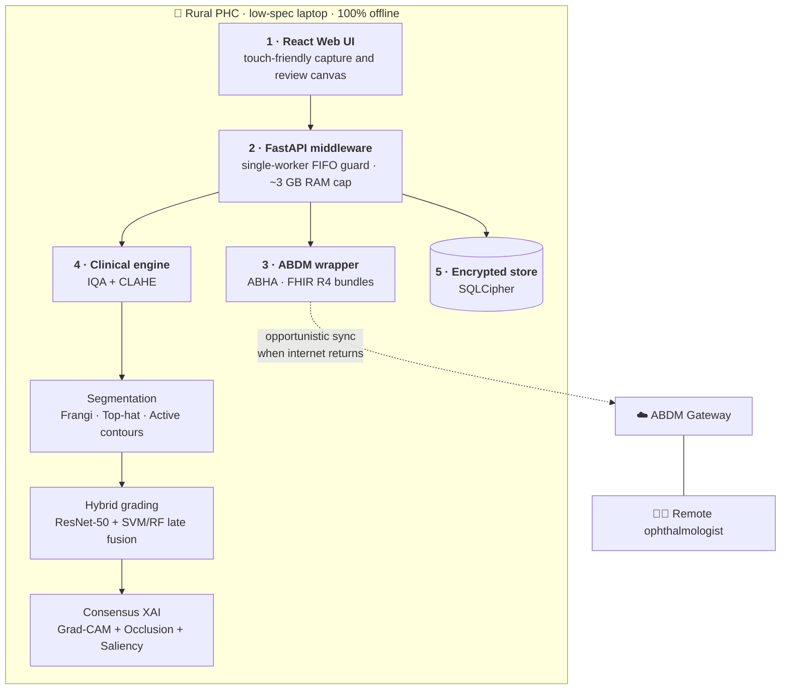
```mermaid
flowchart TB
    subgraph PHC["🏥 Rural PHC · low-spec laptop · 100% offline"]
        UI["<b>1 · React Web UI</b><br/>touch-friendly capture and review canvas"]
        API["<b>2 · FastAPI middleware</b><br/>single-worker FIFO guard · ~3 GB RAM cap"]
        ABDM["<b>3 · ABDM wrapper</b><br/>ABHA · FHIR R4 bundles"]
        IQA["<b>4 · Clinical engine</b><br/>IQA + CLAHE"]
        SEG["Segmentation<br/>Frangi · Top-hat · Active contours"]
        CLS["Hybrid grading<br/>ResNet-50 + SVM/RF late fusion"]
        XAI["Consensus XAI<br/>Grad-CAM + Occlusion + Saliency"]
        DB[("<b>5 · Encrypted store</b><br/>SQLCipher")]
        UI --> API --> IQA --> SEG --> CLS --> XAI
        API --> ABDM
        API --> DB
    end
    ABDM -. "opportunistic sync<br/>when internet returns" .-> GW["☁️ ABDM Gateway"]
    GW --- DR["👩‍⚕️ Remote ophthalmologist"]
```

### Patient journey

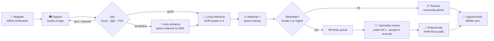
```mermaid
flowchart LR
    A["🪪 Register<br/>ABHA verification"] --> B["📷 Capture<br/>fundus image"]
    B --> C{"IQA<br/>focus · light · FOV"}
    C -- "poor / discard" --> B
    C -- "borderline" --> D["✨ Auto-enhance<br/>green-channel CLAHE"]
    C -- "good" --> E
    D --> E["🧠 Local inference<br/>ICDR grade 0–4"]
    E --> F["🔥 Heatmap +<br/>lesion overlay"]
    F --> G{"Referable?<br/>Grade 2 or higher"}
    G -- "no" --> H["✅ Routine<br/>screening advice"]
    G -- "yes" --> I["⏫ Priority queue"]
    I --> J["👩‍⚕️ Specialist review<br/>under 60 s · accept or override"]
    J --> K["📄 Referral slip<br/>FHIR R4 bundle"]
    H --> L["🔄 Opportunistic<br/>ABDM sync"]
    K --> L
```

### Working prototype (what this repo runs today)

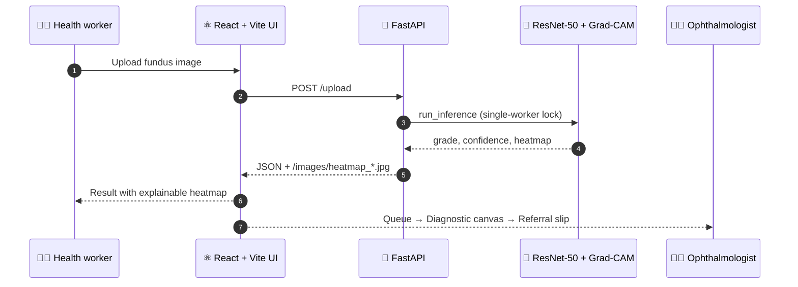
```mermaid
sequenceDiagram
    autonumber
    participant HW as 🧑‍⚕️ Health worker
    participant UI as ⚛️ React + Vite UI
    participant API as 🐍 FastAPI
    participant ML as 🧠 ResNet-50 + Grad-CAM
    participant DR as 👩‍⚕️ Ophthalmologist
    HW->>UI: Upload fundus image
    UI->>API: POST /upload
    API->>ML: run_inference (single-worker lock)
    ML-->>API: grade, confidence, heatmap
    API-->>UI: JSON + /images/heatmap_*.jpg
    UI-->>HW: Result with explainable heatmap
    UI-->>DR: Queue → Diagnostic canvas → Referral slip
```

> If the model file is missing or inference fails, the API **degrades gracefully to pre-computed heatmaps** (mock mode). The demo never shows a raw error to the audience.

---

## 📊 Results

Fine-tuned **ResNet-50** (ImageNet-pretrained) on **APTOS 2019**. Evaluation covers the held-out validation split of **733 images**, scored as *referable DR* (ICDR Grade 2, 3 or 4).

| Metric | Result | SIH target | |
|---|:---:|:---:|:---:|
| **Sensitivity** | **97.65 %** | ≥ 90 % | ✅ |
| **Specificity** | **89.20 %** | ≥ 85 % | ✅ |
| AUC-ROC | 0.978 | — | ✅ |
| PPV (precision) | 86.1 % | — | |
| NPV | 98.2 % | — | |
| F1 score | 0.915 | — | |
| 5-class accuracy | 79.4 % | — | |

Confusion matrix: **TP 291 · TN 388 · FP 47 · FN 7**. The operating threshold of **0.1162** was chosen with Youden's J index on the ROC curve, which maximises sensitivity + specificity. The model is deliberately tuned so that it **rarely misses a patient who needs a specialist**.

<div align="center">
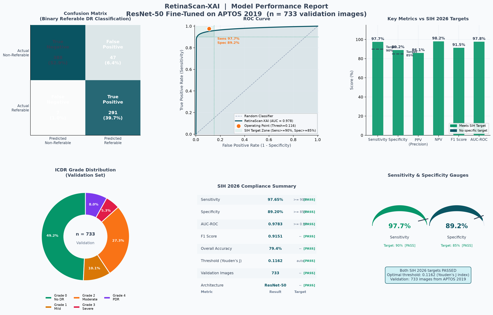
<br/><sub>Full evaluation dashboard (<code>ml_script/model_performance.png</code>). Raw numbers are in <code>ml_script/evaluation_report.json</code>.</sub>
</div>

### 🔥 Explainability: what the model looked at

Every prediction comes with a heatmap on the fundus image. Warm colours mark the regions that pushed the decision.

<div align="center">
<table>
<tr>
<th></th><th>Grade 0<br/><sub>No DR</sub></th><th>Grade 1<br/><sub>Mild</sub></th><th>Grade 2<br/><sub>Moderate</sub></th><th>Grade 3<br/><sub>Severe</sub></th><th>Grade 4<br/><sub>Proliferative</sub></th>
</tr>
<tr>
<td><b>Input</b></td>
<td>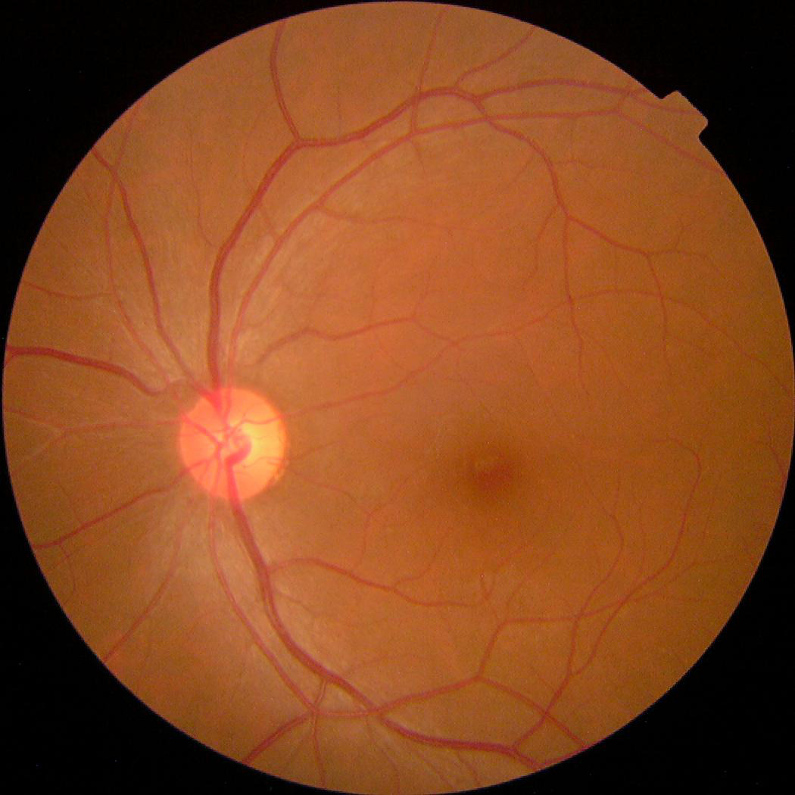</td>
<td>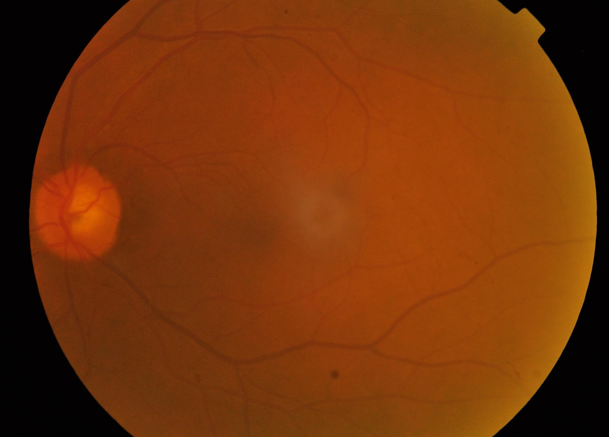</td>
<td>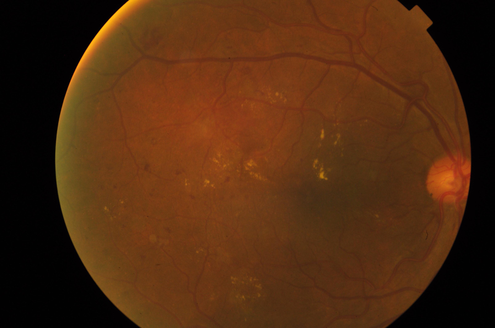</td>
<td>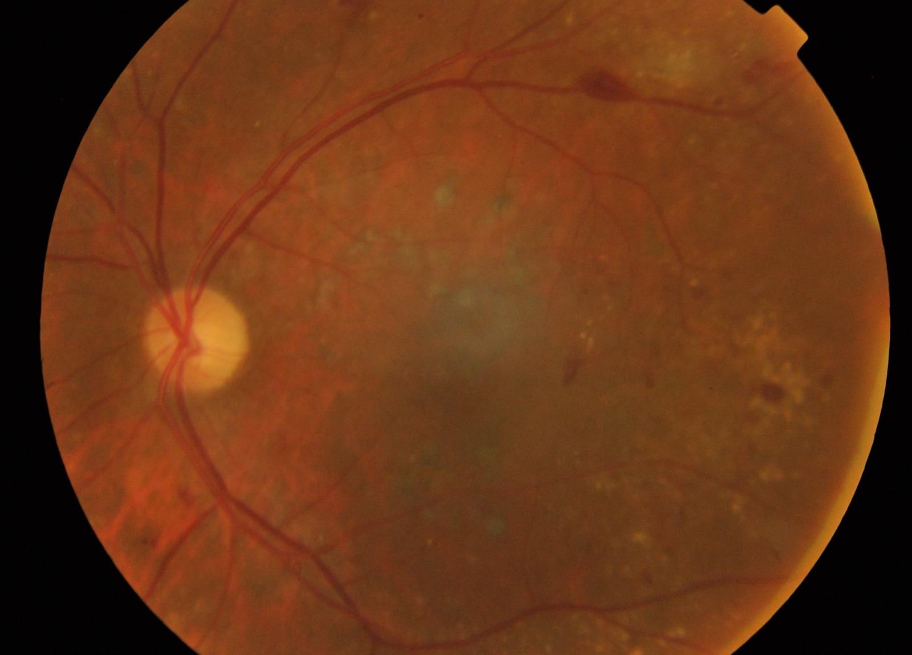</td>
<td>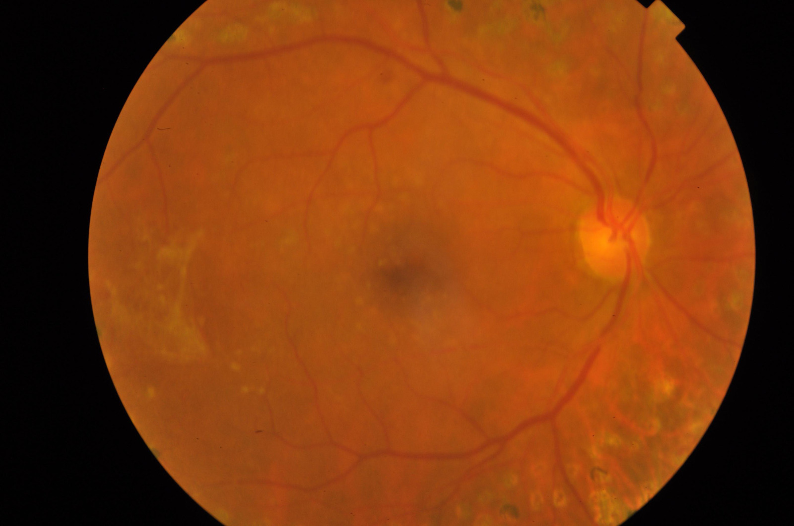</td>
</tr>
<tr>
<td><b>Grad-CAM</b></td>
<td>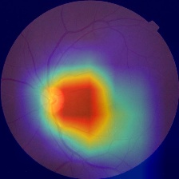</td>
<td>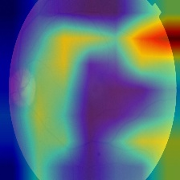</td>
<td>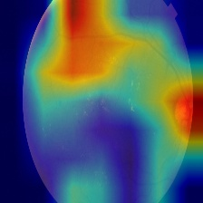</td>
<td>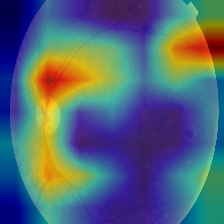</td>
<td>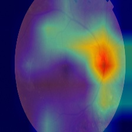</td>
</tr>
<tr>
<td><b>Action</b></td>
<td><sub>Routine annual screening</sub></td>
<td><sub>Review in 6–12 months</sub></td>
<td><sub>Specialist triage required</sub></td>
<td><sub>Urgent specialist referral</sub></td>
<td><sub>Emergency laser / surgical review</sub></td>
</tr>
</table>
</div>

### ⏱️ System capacity (Simulink / SimEvents model)

We modelled the whole screening network as a discrete-event simulation (Poisson patient arrivals, a resource pool of reviewers, and a sync queue). The goal was to prove the system does not collapse during peak surges.

| Parameter | Value |
|---|---|
| Network scale | **100 rural PHCs**, ~100 patients/day/PHC on average, peaks up to 10,000/day |
| Throughput | **100,000+ screenings / year** synced to ABHA |
| Specialist ratio | **1 ophthalmologist : 8 PHCs**, ~30 cases/day each |
| Review speed | **< 60 s / case**, average review wait **< 4.2 min** |
| Latency budget | IQA < 1.5 s + XAI/PDF < 2.0 s, **total < 5.0 s** |
| Field realities modelled | 24.9 % of the time offline, 6.6 % baseline recapture rate |

🔗 [Simulink workflow & capacity simulation (appendix)](https://drive.google.com/file/d/1o0yY94iZkga5ATJJvLCnZBHUwtMZQmxD/view?usp=drive_link)

---

## 🖥️ App Walkthrough

A guided flow that follows the real PHC workflow: **Home → Capture → Quality check → Processing → Results → Queue → Diagnostic canvas → Referral slip.** The screens below are our design prototypes.

<table>
<tr>
<td align="center" width="33%">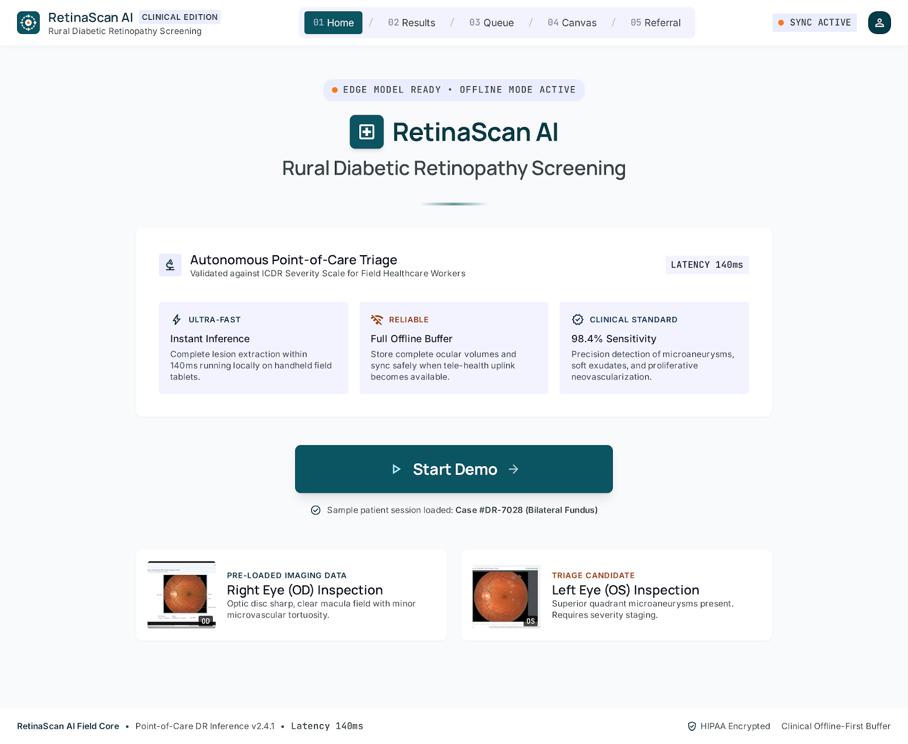<br/><b>1 · Home</b><br/><sub>Offline status, sample patient</sub></td>
<td align="center" width="33%">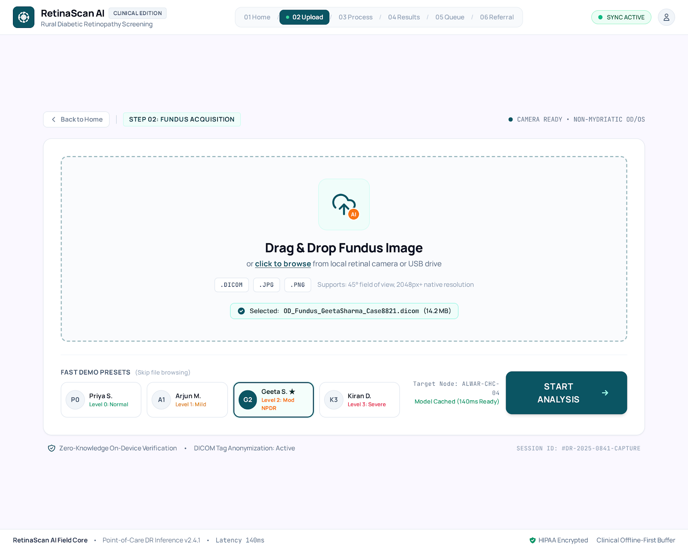<br/><b>2 · Capture / Upload</b><br/><sub>Fundus image intake</sub></td>
<td align="center" width="33%">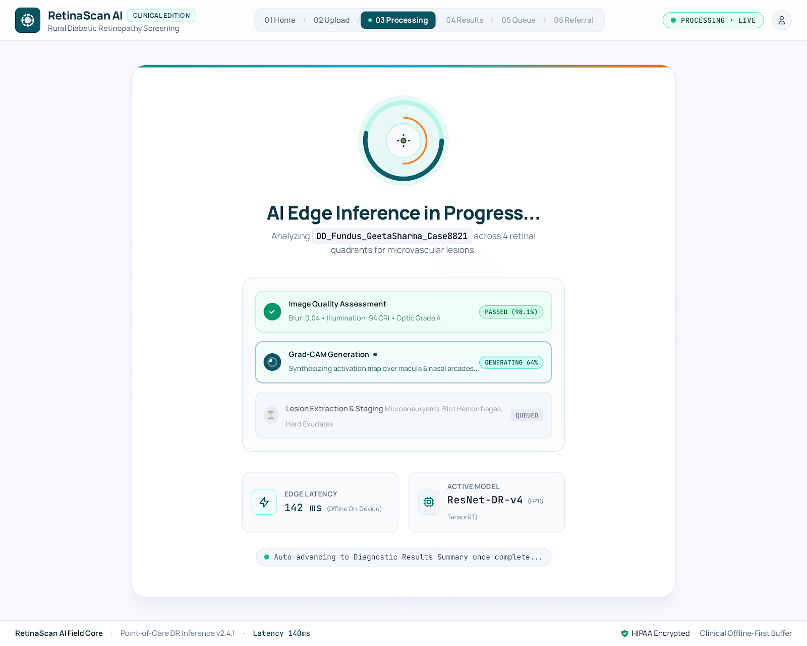<br/><b>3 · Processing</b><br/><sub>Quality check and inference</sub></td>
</tr>
<tr>
<td align="center">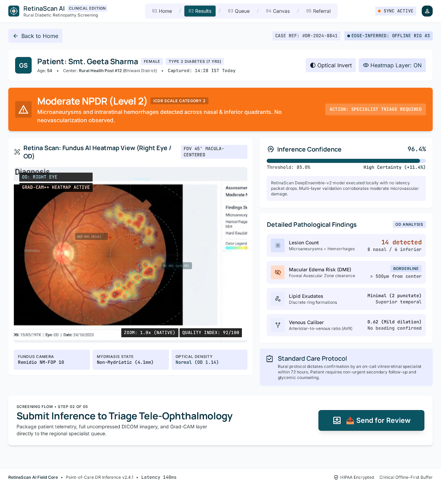<br/><b>4 · Results</b><br/><sub>ICDR grade, confidence, heatmap</sub></td>
<td align="center">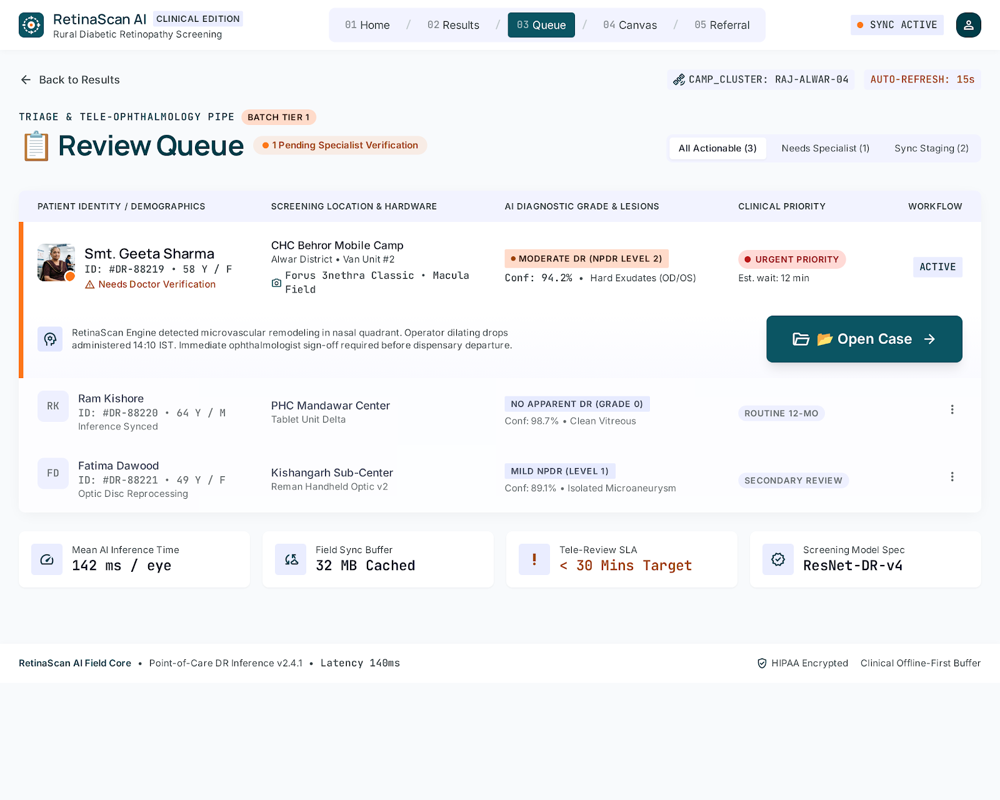<br/><b>5 · Specialist queue</b><br/><sub>Priority-sorted review list</sub></td>
<td align="center">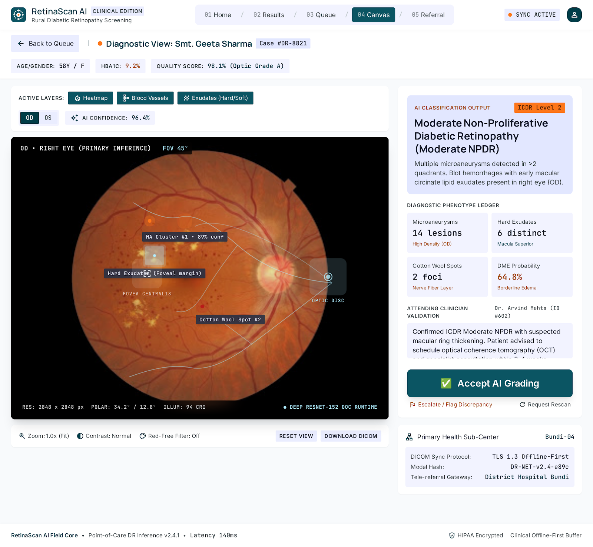<br/><b>6 · Diagnostic canvas</b><br/><sub>Lesion pins, accept / override</sub></td>
</tr>
<tr>
<td align="center" colspan="3">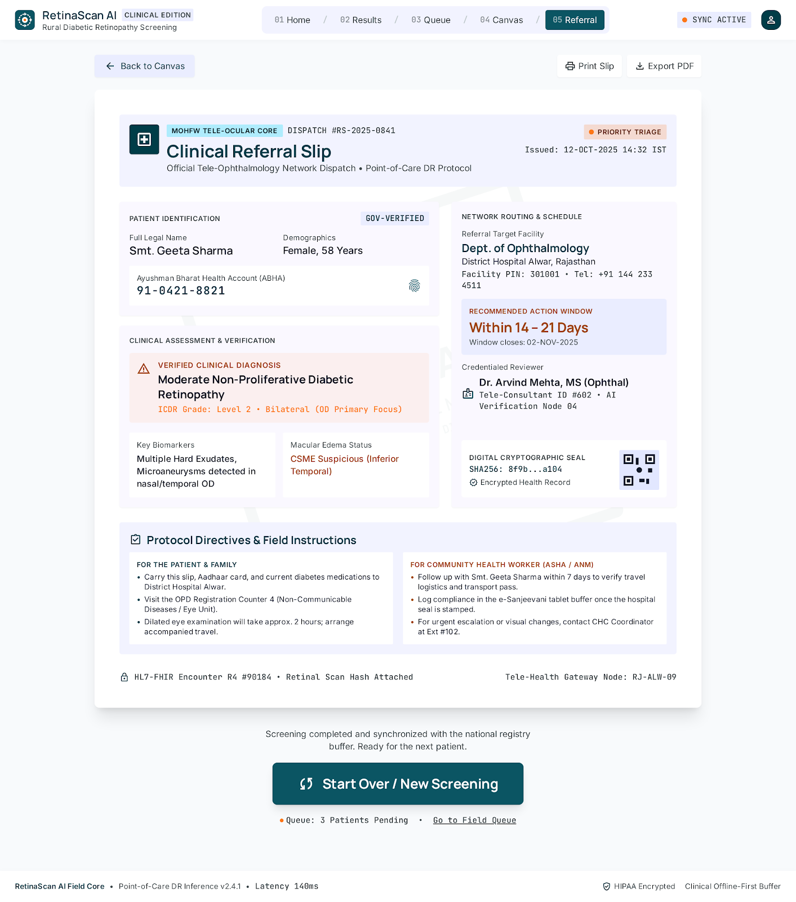<br/><b>7 · Referral clinical slip</b><br/><sub>Printable slip with ABHA ID and FHIR footer</sub></td>
</tr>
</table>

---

## 🧰 Tech Stack

| Layer | Technology |
|---|---|
| **Frontend** | React 19 · Vite 8 · Tailwind CSS 4 · Oxlint |
| **Backend** | Python · FastAPI · Uvicorn · async single-worker inference lock |
| **ML / XAI** | PyTorch + torchvision (ResNet-50) · Grad-CAM · OpenCV · scikit-learn · pandas |
| **Clinical toolkit** | MATLAB: Image Processing, Computer Vision, Medical Imaging, Deep Learning, Statistics toolboxes, Report Generator, Compiler SDK (free MCR runtime) |
| **Interoperability** | ABDM (ABHA) · HL7 FHIR R4 · NRCeS ABDM FHIR profiles |
| **Simulation** | Simulink + SimEvents capacity model |
| **Deployment** | Render (`render.yaml`: FastAPI web service + static React site) |

**Model recipe:** ImageNet-pretrained ResNet-50 with a custom head (`Dropout 0.4 → Linear 512 → ReLU → Dropout 0.3 → Linear 5`). Inputs are 224×224. Training uses AdamW (lr 1e-4, weight decay 1e-4) with a cosine schedule, a class-weighted cross-entropy loss, and a stratified 80/20 split (seed 42).

---

## 🚀 Quick Start

**Prerequisites:** Python 3.10+ and Node.js 20.19+ (required by Vite 8).

### 1 · Clone

```bash
git clone https://github.com/LakshyMaheshwari/SIH26demo.git
cd SIH26demo
```

### 2 · Start the backend (FastAPI)

```bash
cd Backend
python -m venv venv
source venv/bin/activate          # Windows: venv\Scripts\activate
pip install -r requirements.txt   # CPU-only PyTorch, no GPU needed
uvicorn main:app --reload --port 8000
```

Open <http://localhost:8000/health> to check which mode you are in.

### 3 · Start the frontend (React + Vite)

```bash
cd Frontend/retinascan-app
npm install
npm run dev
```

Open the URL Vite prints (usually <http://localhost:5173>). The app talks to `http://localhost:8000` by default. To point it elsewhere, set `VITE_API_URL`.

### 🔀 Two modes: Mock vs Real inference

| Mode | When | What you get |
|---|---|---|
| 🎭 **Mock** *(default)* | `Backend/retinascan_resnet50.pth` is **not** present | Pre-computed heatmaps for all 5 grades. The grade is picked from the uploaded filename (`level_2_*`, `img_3_*`, `demo_1_*`, and so on). Instant and reliable for demos |
| 🧠 **Real** | The weights file **is** present | Live ResNet-50 prediction and a fresh Grad-CAM heatmap for every upload |

> Model weights are not committed (`*.pth` is git-ignored). To enable real mode, train the model as shown below and copy `ml_script/retinascan_resnet50.pth` into `Backend/`.

### 🎓 Train and evaluate the model (optional)

```bash
pip install torch torchvision pillow opencv-python pandas scikit-learn tqdm grad-cam matplotlib
# Edit DATASET_ROOT in ml_script/train_model.py to point at your APTOS 2019 download
python ml_script/train_model.py          # trains and saves retinascan_resnet50.pth
python ml_script/evaluate_model.py       # writes evaluation_report.json (sensitivity / specificity)
python ml_script/visualise_metrics.py    # regenerates model_performance.png
python ml_script/messidor_test.py        # cross-dataset check on Messidor-2
python ml_script/generate_all_heatmaps.py  # Grad-CAM gallery from ml_script/input_images
cp ml_script/retinascan_resnet50.pth Backend/
```

> 🪟 **Windows shortcuts:** `install_deps.bat`, `train_model.bat`, `evaluate_model.bat`, `messidor_test.bat`, `start_backend.bat` and `start_frontend.bat` wrap these steps. They contain a hard-coded Python path in the `PY` variable, so edit it to match your machine first.

### ☁️ Deploy on Render

`render.yaml` provisions both services as a blueprint: a **Python web service** (`Backend/`, `uvicorn main:app`) and a **static site** (`Frontend/retinascan-app/`, `npm run build`). `VITE_API_URL` is wired to the backend host automatically. On Render's free plan the backend sleeps when idle, so the first request after a while can take a short time to wake it up.

### 🎬 Demo tips for presenters

- **`Ctrl + Shift + R`** resets the app to the Home screen and a clean state.
- Use the star preset patient **"Geeta S. ★"** (Moderate NPDR) for the full end-to-end story.
- Sample fundus images for every grade are in `ml_script/input_images/` (`level_{0-4}_{od|os}.jpg`).

---

## 🔌 API Reference

Base URL: `http://localhost:8000`. Interactive docs are at `/docs` (Swagger UI).

| Method | Endpoint | Description |
|---|---|---|
| `GET` | `/` | Service info, current mode and available endpoints |
| `GET` | `/health` | `{ status, model_loaded, inference_mode }` |
| `POST` | `/upload` | Multipart upload (`file`). Returns the DR grade, confidence and heatmap URL |
| `GET` | `/eval-report` | Serves `ml_script/evaluation_report.json` (sensitivity / specificity proof) |
| `GET` | `/images/*` | Static fundus images and generated heatmaps |

```bash
curl -F "file=@ml_script/input_images/level_2_od.jpg" http://localhost:8000/upload
```

```jsonc
{
  "severity": 2,                              // ICDR grade 0–4
  "confidence": 96.4,                         // %
  "label": "Moderate NPDR",
  "action": "Specialist Triage Required",
  "heatmap_url": "/images/heatmap_live_ab12cd34.jpg",
  "all_probs": [0.01, 0.02, 0.96, 0.01, 0.0], // real mode only
  "mode": "real"                              // "real" | "mock" | "fallback"
}
```

**ICDR grade → recommended action**

| Grade | Label | Action |
|:---:|---|---|
| 0 | No Apparent DR | Routine annual screening |
| 1 | Mild NPDR | Review in 6–12 months |
| 2 | Moderate NPDR | **Specialist triage required** |
| 3 | Severe NPDR | **Urgent specialist referral** |
| 4 | Proliferative DR | **Emergency laser / surgical review** |

---

## 🗂️ Repository Structure

```text
SIH26demo/
├── Backend/                      # FastAPI service
│   ├── main.py                   #   API, CORS, mock fallback, inference lock
│   ├── inference.py              #   ResNet-50 loader + Grad-CAM + heatmap overlay
│   └── requirements.txt
├── Frontend/
│   ├── retinascan-app/           # React 19 + Vite + Tailwind app
│   │   ├── src/components/       #   Home · Upload · QualityCheck · Processing ·
│   │   │                         #   Results · Queue · Canvas · Referral · Admin
│   │   ├── src/data.js           #   demo patients, lesion types, severity colours
│   │   └── public/images/        #   fundus samples + pre-computed heatmaps
│   └── stitch_retinascan_demo_prototype/   # design-system prototypes (screens + DESIGN.md)
├── ml_script/
│   ├── train_model.py            # ResNet-50 fine-tuning on APTOS 2019
│   ├── evaluate_model.py         # sensitivity / specificity / AUC → evaluation_report.json
│   ├── messidor_test.py          # cross-dataset test → cross_dataset_report.json
│   ├── generate_all_heatmaps.py  # Grad-CAM gallery
│   ├── visualise_metrics.py      # → model_performance.png
│   ├── input_images/ · output_heatmaps/
│   └── matlab/                   # MATLAB clinical toolkit
│       ├── preprocess_retina.m   #   green channel · CLAHE · Frangi vesselness · normalisation
│       ├── segment_lesions.m     #   microaneurysms · haemorrhages · exudates
│       └── generate_report.m     #   PDF screening report
├── render.yaml                   # one-click Render blueprint
└── *.bat                         # Windows helper scripts
```

---

## 🌍 Impact

**Who it serves:** 🏛️ *Institutional buyers* (State Health Missions, NHM, District Health Societies) · 🧑‍⚕️ *Operational users* (ASHAs / ANMs, remote ophthalmologists, administrators) · 🧑‍🌾 *Beneficiaries* (rural diabetic patients getting last-mile screening).

| Benefit | Impact |
|---|---|
| 💰 **Patient savings** | Saves **₹370** and eliminates **80 km** of round-trip travel per screening |
| ⏱️ **ASHA time** | **3+ hours / week** saved per ASHA (baseline documentation: 4.4 h / week), via automated register entries, ABHA sync and instant PDF reports |
| 🌱 **Environment** | **2.89 kg CO₂** avoided per screening through decentralised diagnostics |
| 👁️ **Blindness prevention** | Early referral targets the **90 %** of vision loss that is preventable |
| ⚖️ **Healthcare equity** | Narrows the rural–urban gap with ABHA-linked longitudinal records |
| 🧾 **Specialist workload** | Cuts review effort from ~5 min to **under 60 s** per case with Grade 2+ auto-prioritisation |
| 🏷️ **Zero lock-in** | No cloud hosting, API subscription or cellular data cost. Compiled MATLAB runs on the free MCR runtime |

### ✅ Feasibility at a glance

| | Challenge | Our mitigation |
|---|---|---|
| 🔧 **Technical** | Poor images from low-cost cameras cause false predictions | Automated IQA with CLAHE enhancement or a guided recapture |
| 💸 **Financial** | Proprietary medical AI means high licence and hardware costs | Offline edge execution on existing laptops, with no GPU and no cloud fees |
| 🏥 **Operational** | Health workers and remote doctors are overloaded | Large-touch-target UI, a one-screen validation canvas, and a Simulink-optimised staffing model |
| 🤝 **Social** | Doctors distrust "black-box" AI | Transparent heatmaps with doctor override and an audit trail |

---

## 🧭 Roadmap & Honest Notes

We want this README to be as honest as the demo is polished. Here is where each part of the vision stands in **this repository today**.

| Component | Status | Notes |
|---|:---:|---|
| ResNet-50 DR grading (0–4) | ✅ Working | Trained on APTOS 2019, with live CPU inference in `Backend/` |
| Grad-CAM explainability | ✅ Working | Generated per upload and shown in Results and Canvas |
| Referable-DR triage metrics | ✅ Working | 97.65 % sensitivity, 89.20 % specificity on the held-out validation split |
| FastAPI + single-worker guard | ✅ Working | Async lock serialises inference to cap memory |
| Mock / fallback mode | ✅ Working | Keeps the demo robust without the weights file |
| MATLAB preprocessing, lesion segmentation, PDF report | ✅ Working | Standalone scripts in `ml_script/matlab/` |
| IQA scoring screen | 🎭 Demo-simulated | The UI animates the focus / illumination / FOV checks with representative scores |
| Specialist queue, lesion pins, referral slip | 🎭 Demo-simulated | Driven by sample patient data in `src/data.js` |
| ABHA verification and FHIR R4 bundle | 🎭 UI mock | The screens show the flow, and the live FHIR / ABDM gateway integration is planned |
| Occlusion + Saliency consensus XAI | 🛣️ Planned | Prototype currently ships Grad-CAM only |
| SVM / Random-Forest late-fusion ensemble | 🛣️ Planned | Prototype currently uses the ResNet-50 classifier alone |
| Encrypted SQLite (SQLCipher) offline store and LWW sync | 🛣️ Planned | Designed in the architecture, not yet in the repo |
| Compiled MATLAB engine behind FastAPI | 🛣️ Planned | Prototype runs the Python inference path |

**Known limitations**

- **Domain shift.** Our own Messidor-2 cross-dataset run (`cross_dataset_report.json`) shows the APTOS-trained model generalises **poorly** to that dataset. It under-calls referable DR versus published prevalence, and Messidor-2 has no per-image grade labels, so the comparison is dataset-level only. The headline metrics above come from a held-out split of **APTOS**, which is the same source as the training data, and are **not** an external validation.
- **Next steps:** fine-tune on IDRiD and Messidor-2, add the IQA-driven normalisation to the live pipeline, calibrate confidence on external data, and run a prospective pilot with PHC clinicians.

> ⚠️ **Disclaimer:** RetinaScan-XAI is a research and hackathon prototype. It is **not a certified medical device** and must not be used for real clinical diagnosis. Every AI output requires review by a qualified ophthalmologist.

---

## 🏆 Team

<div align="center">

| | |
|---|---|
| **Team** | **TheBIG(O)** |
| **Team ID** | 173175 |
| **Problem Statement** | SIH26038 · *Explainable AI for Diabetic Retinopathy Screening in Rural India* |
| **Theme / Category** | MedTech / Software |
| **Repository maintainer** | [Lakshy Maheshwari](https://github.com/LakshyMaheshwari) |

</div>

---

## 📚 References & Data

**Datasets:** [APTOS 2019 Blindness Detection](https://www.kaggle.com/competitions/aptos2019-blindness-detection/data) · [IDRiD (Indian Diabetic Retinopathy Image Dataset)](https://ieee-dataport.org/open-access/indian-diabetic-retinopathy-image-dataset-idrid) · [Messidor-2](https://www.adcis.net/en/third-party/messidor2/)

**Research and standards**

1. Chauhan A, et al. *Reach and implementation of human and AI-assisted diabetic retinopathy screening models in primary healthcare settings in India.* Scientific Reports 2025;15:41355. [Link](https://www.nature.com/articles/s41598-025-25402-9)
2. Duggal M, et al. *Real-world evaluation of AI-driven diabetic retinopathy screening in public health settings.* International Ophthalmology, 2025/2026. [Link](https://link.springer.com/article/10.1007/s10792-026-04171-y)
3. *An inherently interpretable AI model improves screening speed and accuracy for early diabetic retinopathy.* PLOS Digital Health / medRxiv, 2024–2025. [Link](https://pmc.ncbi.nlm.nih.gov/articles/PMC12068651/)
4. Karthik A, Pandiyaraju V, Mynampati S. *Explainable AI for Diabetic Retinopathy Detection Using Deep Learning with Attention Mechanisms and Fuzzy Logic-Based Interpretability.* arXiv:2511.16294, 2025. [Link](https://arxiv.org/pdf/2511.16294)
5. Guo T, et al. *Refined image quality assessment for color fundus photography based on deep learning.* DIGITAL HEALTH, 2024. [Link](https://doi.org/10.1177/20552076231207582)
6. National Health Authority. *Guidelines for HIPs and HIUs, HRPs and PHR Apps.* Ayushman Bharat Digital Mission, 2022. [PDF](https://abdm.gov.in/strapicms/uploads/HIP_HIU_Guidelines_f85df336ec.pdf)
7. NRCeS. *FHIR Implementation Guide for ABDM: DiagnosticReport & Observation Profiles (v2.0.1).* National Health Authority, 2021. [Link](https://nrces.in/ndhm/fhir/r4/2.0.1/downloads.html)

📎 [Appendix: Healthcare Economics](https://drive.google.com/file/d/1VNoBBwvH3vQcLc6dvWKc4hfIXP-1liOd/view?usp=drive_link) · 📎 [Appendix: Simulink Workflow](https://drive.google.com/file/d/1o0yY94iZkga5ATJJvLCnZBHUwtMZQmxD/view?usp=drive_link)

---

<div align="center">

**Built with ❤️ for rural India by TheBIG(O) · Smart India Hackathon 2026**

*Because no one should lose their sight for lack of a screening.*

<sub>⭐ If this project resonates with you, consider starring the repo.</sub>

</div>
